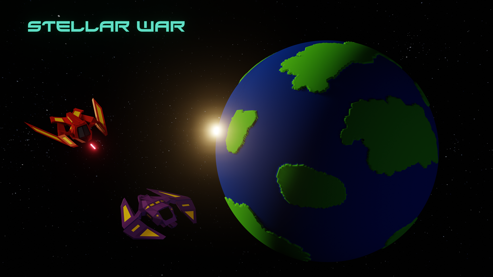

Welcome to Stellar War!

Summer project that I have created with @treachGit.

Here are some functionalities:

You can mark multiple ships and make them move to a specific point:

Their movement is also smart, they avoid planets and other obstacles:

Marked ships can also attack enemy ones!

Why limit to shooting ships? They can also destroy buildings on planets:

Having destroyed this building lets place some more!

@treachGit made **every** object there is in game.  
I have written code responsible for these functionalities.
